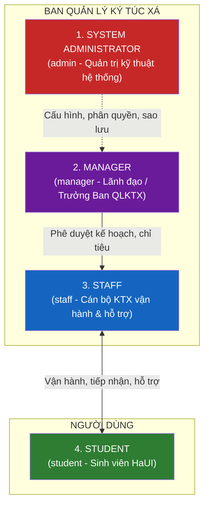
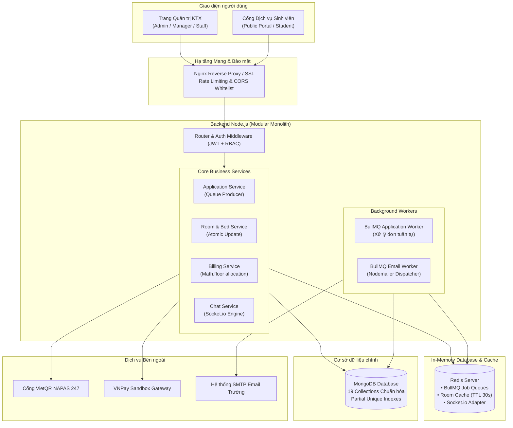

# 01 – TỔNG QUAN DỰ ÁN

**Tên đề tài:** Xây dựng hệ thống web quản lý Ký túc xá Trường Đại học Công nghiệp Hà Nội
**Tên hệ thống:** DMS-KTX HaUI (Dormitory Management System - HaUI)
**Phiên bản:** v2.0 (Chuẩn hóa toàn diện theo nghiệp vụ thực tế HaUI & KTX 4.0)
**Ngày cập nhật:** 03/10/2026

---

## 1. Bối cảnh và lý do chọn đề tài

### 1.1. Hiện trạng công tác quản lý KTX tại Trường Đại học Công nghiệp Hà Nội (HaUI)

Trường Đại học Công nghiệp Hà Nội là cơ sở giáo dục đại học công lập đa ngành quy mô lớn với hơn 30.000 sinh viên theo học tại **3 cơ sở đào tạo**:
- **Cơ sở 1 (CS1):** Số 298 đường Cầu Diễn, phường Minh Khai, quận Bắc Từ Liêm, TP. Hà Nội.
- **Cơ sở 2 (CS2):** Phường Tây Tựu, quận Bắc Từ Liêm, TP. Hà Nội.
- **Cơ sở 3 (CS3):** Phường Lê Hồng Phong, TP. Phủ Lý, tỉnh Hà Nam (nơi tập trung 100% tân sinh viên học kỳ giáo dục quốc phòng và giáo dục thể chất).

Ký túc xá HaUI hiện phục vụ hàng nghìn chỗ ở nội trú cho sinh viên cả nước và lưu học sinh quốc tế. Tuy nhiên, qua khảo sát thực tế, công tác quản lý KTX vẫn còn tồn tại nhiều hình thức thủ công, bán tự động phân tán:

| Hình thức vận hành hiện tại | Mức độ áp dụng | Hạn chế và bất cập |
|-----------------------------|----------------|---------------------|
| Sổ sách giấy + File Excel phân tán | Chủ yếu tại các cơ sở | Dữ liệu phòng và giường phân mảnh theo từng cơ sở, dễ nhầm lẫn số liệu, không thể kiểm soát lấp đầy thời gian thực |
| Đăng ký tại quầy / Cổng rời rạc | Đầu các học kỳ | Sinh viên và phụ huynh chen chúc nộp hồ sơ xét duyệt giấy; nghẽn mạng cục bộ khi mở cổng đăng ký |
| Thu tiền mặt và đối soát thủ công | Định kỳ hàng tháng | Rủi ro thất thoát tiền mặt; mất nhiều ngày công để gạch nợ tiền điện nước của từng phòng |

### 1.2. Các vấn đề nghiệp vụ cốt lõi cần giải quyết

1. **Quá tải và nghẽn hệ thống trong ngày mở đợt đăng ký KTX (Flash-Spike Traffic):** Đầu năm học hoặc đầu kỳ mới, hàng nghìn sinh viên cùng truy cập nộp đơn trong khung giờ 15–30 phút đầu. Các hệ thống web truyền thống thường sập do quá tải truy vấn CSDL.
2. **Nguy cơ xếp trùng giường (Race Condition):** Khi nhiều cán bộ cùng phân phòng hoặc xếp chỗ song song, nếu không có cơ chế khóa nguyên tử ở tầng database sẽ dẫn đến việc 2 sinh viên bị xếp vào cùng 1 giường.
3. **Bài toán nhân văn và thể chất (Accessibility):** Các sinh viên có hoàn cảnh đặc biệt (khuyết tật vận động, bệnh tim mạch, chấn thương thể thao...) thường bị phân ngẫu nhiên lên giường tầng trên (`upper bed`) hoặc tầng cao của tòa nhà không thang máy, gây nguy hiểm và bất tiện lớn.
4. **Phức tạp trong chu kỳ tài chính và chia tiền điện nước:** Tiền phòng thu trọn gói theo hợp đồng (đợt 8.5 tháng tại CS3 Hà Nam hoặc 10–12 tháng tại CS1/CS2), trong khi tiền điện nước chốt hàng tháng theo chỉ số đồng hồ của phòng và phải chia đều không lệch một đồng cho từng thành viên.
5. **Thiếu kênh giao tiếp thời gian thực:** Sinh viên gặp sự cố điện nước, hỏng hóc thiết bị không biết báo ai hoặc báo qua nhóm mạng xã hội trôi tin, không thể truy vết trạng thái sửa chữa.

---

## 2. Mục tiêu dự án

### 2.1. Mục tiêu tổng quát

Xây dựng hệ thống web **DMS-KTX HaUI** hiện đại, hoạt động trên nền tảng đám mây, số hóa toàn diện quy trình tiếp nhận đơn công khai, xét duyệt theo đợt, cấp tài khoản tự động, quản lý hợp đồng lưu trú, chốt điện nước, thanh toán VietQR động và tiếp nhận báo hỏng trực tuyến tại cả 3 cơ sở của HaUI.

### 2.2. Mục tiêu cụ thể (Đo lường bằng chỉ số KPI)

| # | Mục tiêu cụ thể | Chỉ số đo (KPI) |
|---|-----------------|-----------------|
| **G1** | Quản lý không gian tập trung 3 cơ sở | 100% Cơ sở, Tòa nhà, Phòng và Giường tầng được số hóa; tra cứu tình trạng phòng trống với độ trễ < 5ms (nhờ Redis Cache) |
| **G2** | Chịu tải cao đợt mở cổng KTX | Tiếp nhận ổn định ≥ 1.000 req/s thông qua cơ chế hàng đợi bất đồng bộ Redis BullMQ mà không làm sập máy chủ |
| **G3** | Triệt tiêu 100% lỗi xếp trùng giường | 0 trường hợp trùng giường nhờ cơ chế conditional update nguyên tử trên MongoDB (`Bed.status: 'available'`) |
| **G4** | Tự động hóa cấp tài khoản | 100% sinh viên trúng tuyển nhận được Email tự động chứa thông tin tài khoản và mật khẩu tạm thời kèm mã trúng tuyển |
| **G5** | Tối ưu hóa tính nhân văn | 100% sinh viên khai báo và xác nhận có vấn đề thể chất được tự động khóa vào giường tầng dưới (`lower bed`) |
| **G6** | Tự động hóa thanh toán VietQR | Sinh viên thanh toán tiền phòng/điện nước qua mã QR động (chuẩn NAPAS 247), hệ thống tự động gạch nợ tức thời qua Webhook |
| **G7** | Rút ngắn thời gian nhận phòng | Check-in nhận phòng bằng quét mã QR cá nhân trong < 30 giây tại bàn trực KTX |

---

## 3. Phạm vi dự án

### 3.1. Trong phạm vi (In-scope) – Phiên bản hoàn chỉnh

Hệ thống được thiết kế thành **10 phân hệ nghiệp vụ hoàn chỉnh (M1 đến M10)**:

1. **M1. Quản lý Cơ cấu Không gian 4 cấp (Campus → Building → Room → Bed):** Quản lý 3 cơ sở của HaUI; phân chia tòa nhà theo giới tính (`male`, `female`, `mixed`); quản lý phòng theo tầng, loại phòng (4, 6, 8 chỗ, có/không điều hòa); quản lý từng vị trí giường tầng (`lower`, `upper`).
2. **M2. Đợt mở KTX & Nộp đơn công khai:** Quản lý đợt tiếp nhận theo học kỳ/năm học; Cổng nộp đơn công khai cho tân sinh viên và sinh viên đang học bằng MSSV; ghi nhận nguyện vọng loại phòng, diện ưu tiên và tình trạng sức khỏe (`hasHealthCondition`).
3. **M3. Xét duyệt đơn & Tự động cấp tài khoản:** Hội đồng xét duyệt đơn theo tiêu chí ưu tiên; tự động xếp phòng/giường; tự động sinh tài khoản người dùng (`Username = MSSV`), mật khẩu tạm thời và gửi email thông báo trúng tuyển qua Nodemailer.
4. **M4. Hợp đồng lưu trú & Check-in QR:** Quản lý vòng đời hợp đồng (`draft` → `active` → `expired` / `terminated`); cấp mã QR Check-in cho sinh viên; cán bộ dùng máy quét/điện thoại quét mã bàn giao giường và tài sản.
5. **M5. Quản lý Sinh viên nội trú:** Hồ sơ nhân thân, thông tin liên hệ khẩn cấp của phụ huynh, lịch sử lưu trú, lịch sử thanh toán và danh sách bạn cùng phòng.
6. **M6. Điện nước & Tài chính:** Nhập chỉ số đồng hồ điện/nước theo lô (theo Tòa/Tầng); tự động tính bậc thang và chia đều tiền phòng `Math.floor` + dồn dư cho MSSV nhỏ nhất; quản lý thu tiền cọc tài sản và quyết toán cọc khi trả phòng.
7. **M7. Thanh toán VietQR & Cổng thanh toán:** Tạo mã VietQR động chuẩn Napas247 chứa chính xác số tiền và nội dung hóa đơn; tích hợp thanh toán thẻ/ATM qua VNPay Sandbox; gạch nợ tự động qua Webhook Idempotent.
8. **M8. Nghiệp vụ phát sinh (Chuyển phòng, Báo hỏng, Kỷ luật):** Đơn xin chuyển phòng; phiếu báo hỏng thiết bị và theo dõi sửa chữa; lập biên bản vi phạm nội quy và trừ điểm rèn luyện.
9. **M9. Tương tác KTX 4.0 (Chat, Thông báo, Bảng tin):** Kênh chat trực tuyến thời gian thực giữa sinh viên và cán bộ trực KTX (Socket.io); hệ thống chuông thông báo cá nhân; bảng tin thông báo chung KTX.
10. **M10. Báo cáo thống kê & Dashboard:** Biểu đồ tỷ lệ lấp đầy theo cơ sở/tòa nhà, phân tích doanh thu tiền phòng/điện nước, danh sách sinh viên nợ tiền quá hạn, xuất báo cáo Excel/CSV.

### 3.2. Ngoài phạm vi (Out-of-scope)

- **Không làm:** Mô hình Multi-tenant cho nhiều trường đại học khác nhau (hệ thống được thiết kế chuyên biệt hóa tối đa cho 3 cơ sở của HaUI).
- **Không làm:** Module bán hàng nhu yếu phẩm / thương mại điện tử mini (không phù hợp với nghiệp vụ KTX công lập).
- **Không làm:** Đăng ký vắng mặt online (không mang lại giá trị quản lý thực tế, sinh viên tuân thủ giờ mở cửa KTX).
- **Không làm:** Tích hợp phần cứng kiểm soát ra vào vân tay/thẻ từ RFID vật lý (được đề xuất ở hướng phát triển mở rộng trong báo cáo).

---

## 4. Các tác nhân hệ thống (4 Roles)

Hệ thống được thiết kế chuẩn mực với **4 nhóm tác nhân (Roles)**:

1. **System Administrator (`admin`):** Quản trị kỹ thuật hệ thống, quản lý tài khoản người dùng, phân quyền vai trò, cấu hình hệ thống, quản lý cơ sở và giám sát bảo mật.
2. **Manager (`manager` - Trưởng ban KTX):** Ban hành chính sách, mở đợt tiếp nhận KTX, duyệt kết quả trúng tuyển, duyệt đơn xin chuyển phòng, duyệt quyết toán hoàn cọc tài sản, theo dõi báo cáo doanh thu tài chính.
3. **Staff (`staff` - Cán bộ KTX):** Quản lý tiếp nhận hồ sơ, bàn giao phòng qua mã QR, ghi chỉ số điện nước theo lô, lập hóa đơn, điều phối bảo trì sự cố, lập biên bản vi phạm, trực chat hỗ trợ sinh viên.
4. **Student (`student` - Sinh viên):** Nộp đơn đăng ký công khai, đổi mật khẩu lần đầu, quét mã QR nhận phòng, thanh toán VietQR tiền phòng/điện nước, gửi yêu cầu báo hỏng/chuyển phòng/trả phòng, nhắn tin trực tiếp với cán bộ KTX.

---

## 5. Kiến trúc hệ thống tổng thể

---

## 6. Lịch sử phiên bản tài liệu

| Phiên bản | Ngày | Người thực hiện | Nội dung thay đổi |
|-----------|------|------------------|-------------------|
| v1.0 | 11/09/2026 | Nhóm phát triển | Khởi tạo tài liệu tổng quan ban đầu (chưa chuyên biệt hóa) |
| **v2.0** | **03/10/2026** | **Lead Kỹ thuật & BA** | **Đồng bộ hóa toàn diện theo bối cảnh thực tế Trường Đại học Công nghiệp Hà Nội (HaUI 3 cơ sở):** Chuẩn hóa 4 vai trò tác nhân (`admin`, `manager`, `staff`, `student`); bổ sung kiến trúc chịu tải cao (Redis Queue BullMQ, Cache-Aside); bổ sung VietQR động, Quét mã QR Check-in, Chat Socket.io; loại bỏ các tính năng phi thực tế (shop nhu yếu phẩm, vắng mặt). |
