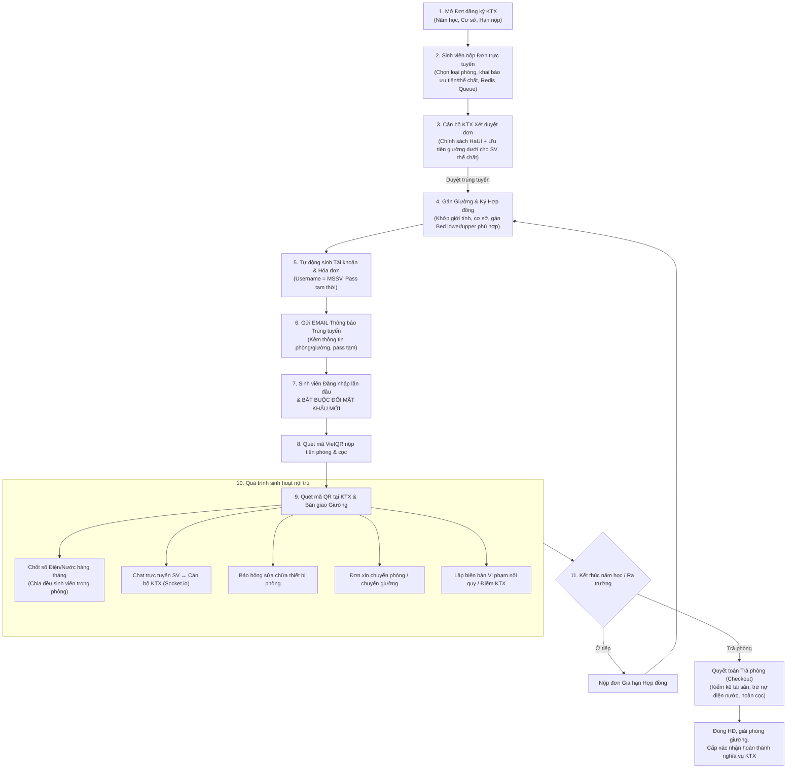

# 03 – PHÂN TÍCH NGHIỆP VỤ (BUSINESS ANALYSIS)

**Đơn vị áp dụng:** Trường Đại học Công nghiệp Hà Nội (HaUI)  
**Hệ thống:** DMS – Quản lý Ký túc xá  
**Phiên bản:** 2.3 (Chuẩn hóa thực tế, Tự cấp tài khoản & Ưu tiên thể chất)

---

## 1. Mô hình nghiệp vụ tổng thể KTX HaUI



---

## 2. Máy trạng thái các thực thể (State Machines)

### 2.1. Giường — `Bed.status`
`available` (trống) ⇄ `occupied` (đang ở) ⇄ `maintenance` (bảo trì).
* Giường đang `occupied` không được chuyển trực tiếp sang `maintenance`.
* Giường có vị trí tầng: `position: 'lower'` (tầng dưới) và `position: 'upper'` (tầng trên).

### 2.2. Đơn đăng ký — `Application.status`
`pending` (chờ duyệt) → `approved` (đã duyệt, đã gán giường, đã sinh tài khoản) / `rejected` (từ chối kèm lý do).

### 2.3. Hợp đồng — `Contract.status`
`active` (đang ở) → `expired` (quá hạn) / `terminated` (đã trả phòng / chấm dứt).

### 2.4. Hóa đơn — `Invoice.status`
`unpaid` → `partial` → `paid` / `overdue` / `cancelled`.

### 2.5. Đơn yêu cầu phát sinh — `StudentRequest.status`
`pending` → `approved` / `rejected` → `completed` (nghiệm thu sửa chữa/nhận giường mới xong).

---

## 3. Quy tắc nghiệp vụ chi tiết (Business Rules — BR)

### 3.1. Cơ cấu không gian & Giường tầng
- **BR-01 (Giới tính phòng):** `Student.gender == Room.gender`. Tuyệt đối chặn nam nữ chung phòng.
- **BR-02 (Cập nhật nguyên tử chống trùng giường):**
  ```js
  const bed = await Bed.findOneAndUpdate(
    { _id: bedId, status: 'available' },
    { status: 'occupied' },
    { new: true }
  );
  if (!bed) throw new ApiError(409, 'BED_NOT_AVAILABLE', 'Giường đã có người ở');
  ```
- **BR-03 (Sức chứa phòng):** Tổng số giường = `Room.capacity`.

### 3.2. Nộp đơn công khai, Hàng đợi Queue & Phân bổ giường theo Thể chất
- **BR-10 (Nộp đơn công khai không cần tài khoản):** Sinh viên nộp đơn online trong đợt mở (`RegistrationPeriod.status == 'open'`) bằng MSSV và thông tin cá nhân. Hệ thống tự động gửi email xác nhận đã tiếp nhận đơn.
- **BR-11 (Mỗi sinh viên một đơn/đợt):** `periodId + studentId` unique.
- **BR-12 (Dàn phẳng tải bằng Redis Queue):** Vào thời điểm mở cổng, request nộp đơn được đẩy vào hàng đợi `queue:dorm-application`. Hệ thống phản hồi ngay mã số vé hàng đợi. Worker nhặt đơn xử lý tuần tự xuống MongoDB với tốc độ tối đa 100 req/s, đảm bảo server không bao giờ bị nghẽn hay sập.
- **BR-13 (Tiêu chí ưu tiên xét duyệt HaUI):**
  1. Con liệt sĩ, con thương binh nặng (`policy_family`).
  2. Hộ nghèo, mồ côi cả cha lẫn mẹ (`poor_household`).
  3. Vùng sâu vùng xa, biên giới, hải đảo (`remote_area`).
  4. Tân sinh viên khóa mới ở tỉnh xa (ưu tiên cơ sở Hà Nam).
  5. Sinh viên năm trước có điểm rèn luyện KTX tốt và không vi phạm nội quy.
- **BR-16 (Ưu tiên Giường tầng dưới cho Sinh viên có vấn đề thể chất):**
  - Khi sinh viên khai báo `hasHealthCondition: true` (khuyết tật vận động, bệnh tim mạch, chấn thương chân...) kèm minh chứng y tế hợp lệ:
  - Hệ thống **TỰ ĐỘNG LỌC VÀ CHỈ GÁN GIƯỜNG TẦNG DƯỚI (`Bed.position == 'lower'`)**.
  - **Chặn tuyệt đối** việc gán sinh viên có chỉ định y tế lên giường tầng trên (`upper`).
  - Đối với tòa nhà KTX không có thang máy (`hasElevator == false`), hệ thống tự động ưu tiên xếp sinh viên vào phòng ở **Tầng 1 hoặc Tầng 2**.
- **BR-14 (Tự động cấp tài khoản khi trúng tuyển):** Khi Manager/Staff bấm Duyệt đơn:
  - Hệ thống tự sinh tài khoản `User`: `email = Student.email`, `passwordHash = bcrypt(tempPassword)`, `role = 'student'`, `mustChangePassword = true`.
  - Tự động kích hoạt **Email thông báo trúng tuyển KTX**: gửi đến email sinh viên chúc mừng trúng tuyển, thông báo chi tiết phòng/giường, cung cấp tên đăng nhập (MSSV) và mật khẩu tạm thời, hướng dẫn đăng nhập đổi mật khẩu và nộp tiền phòng qua VietQR trong vòng 7 ngày.
- **BR-15 (Cưỡng bức đổi mật khẩu lần đầu):** Sinh viên đăng nhập lần đầu bằng tài khoản tạm thời nhận từ Email bắt buộc phải đổi sang mật khẩu mới riêng của mình trước khi được truy cập các tính năng của Cổng sinh viên.

### 3.3. Hợp đồng & Tiền phòng
- **BR-20 (Thời hạn hợp đồng linh hoạt):** 
  - Tân sinh viên học tại Cơ sở 3 (Hà Nam): Hợp đồng tính theo thời gian năm nhất thực tế (`8.5` tháng).
  - Sinh viên từ năm 2 trở đi học tại CS1 / CS2: Hợp đồng theo năm học (`10` hoặc `12` tháng).
- **BR-21 (Tiền phòng đóng trọn gói):** $\text{roomPrice} = \text{pricePerMonth} \times \text{totalMonths}$. Không thu lắt nhắt từng tháng.
- **BR-22 (Tiền cọc tài sản):** Thu một lần khi nhận phòng (`depositAmount`).

### 3.4. Điện nước hàng tháng
- **BR-30 (Chốt số theo Tòa/Tầng):** Cán bộ nhập chỉ số điện nước cuối tháng dạng bảng cho cả tòa (`UtilityReading`).
- **BR-31 (Ràng buộc):** `electricityEnd >= electricityStart` và `waterEnd >= waterStart`.
- **BR-32 (Chia đều không lệch 1 đồng):**
  ```js
  const total = (elecEnd - elecStart) * elecPrice + (waterEnd - waterStart) * waterPrice;
  const n = activeStudents.length;
  const base = Math.floor(total / n);
  const remainder = total - (base * n);
  // Sinh viên đầu tiên (MSSV nhỏ nhất) nhận: base + remainder
  // Các sinh viên còn lại nhận: base
  ```
- **BR-33 (Khóa chỉ số):** Đã bấm sinh hóa đơn (`isInvoiced = true`) thì cấm sửa chỉ số.

### 3.5. Thanh toán thông minh (VietQR & Webhook)
- **BR-40 (VietQR động):** Mỗi hóa đơn tự động render mã VietQR chuẩn NAPAS nhúng sẵn: STK Ban quản lý + Số tiền chính xác + Nội dung chuyển khoản là `invoiceCode`.
- **BR-41 (Xử lý Webhook qua Queue & Idempotent):** Webhook thanh toán từ cổng được đẩy vào `queue:payment-webhook` để xử lý bất đồng bộ. Kiểm tra chữ ký số trước, nếu Payment đã `success` thì bỏ qua (chống ghi nhận 2 lần).

### 3.6. Check-in nhận phòng bằng mã QR
- **BR-45 (Điều kiện Check-in):** Hợp đồng phải ở trạng thái `active` và hóa đơn ban đầu đã thanh toán `paid`.
- **BR-46 (Quét mã bàn giao):** Cán bộ KTX quét mã QR trên màn hình sinh viên → Hệ thống xác thực hợp lệ → Ghi nhận `Contract.checkinAt = now` và bàn giao chìa khóa, giường/tủ cho sinh viên.

### 3.7. Kênh Chat trực tuyến & Bảng tin KTX
- **BR-50 (Quyền riêng tư cuộc hội thoại):** Mỗi sinh viên có một kênh hội thoại (`Conversation`) trực tiếp với Ban quản lý KTX. Cán bộ trực ca tiếp nhận và phản hồi tin nhắn qua WebSocket (Socket.io).
- **BR-51 (Đính kèm hình ảnh):** Cho phép sinh viên gửi ảnh chụp hiện trường (hỏng hóc, sự cố điện nước).
- **BR-52 (Thông báo đẩy tức thì):** Khi có sự kiện quan trọng (duyệt đơn, hóa đơn mới, phản hồi báo hỏng), hệ thống vừa tạo bản ghi `Notification` vừa phát tín hiệu socket tới thiết bị của sinh viên.

### 3.8. Chuyển phòng & Trả phòng (Checkout)
- **BR-60 (Chuyển phòng):** Cán bộ duyệt đơn chuyển phòng → gán giường mới (phải `available` và khớp giới tính), giải phóng giường cũ. Nếu đổi sang loại phòng khác giá, hệ thống sinh hóa đơn bù trừ chênh lệch cho các tháng còn lại.
- **BR-61 (Quyết toán hoàn cọc khi trả phòng):**
  $$\text{refund} = \text{depositAmount} - \text{outstandingDebt} - \text{compensationFee}$$
  - Nếu $\text{refund} > 0$: Tạo hóa đơn `settlement` và tạo phiếu chi `Payment` (type: `refund`, status: `success`). Ghi nhận `depositRefunded = refund`.
  - Giải phóng giường về `available`, chuyển `Contract.status = 'terminated'`.
- **BR-62 (Xác nhận hoàn thành nghĩa vụ KTX):** Hệ thống chỉ xuất Giấy xác nhận không nợ KTX khi hợp đồng đã thanh lý và tổng công nợ = 0.

### 3.9. Sinh viên tốt nghiệp
- **BR-70 (Bảo lưu dữ liệu lịch sử):** Khi sinh viên tốt nghiệp: `Student.status = 'graduated'`. Toàn bộ lịch sử hợp đồng, hóa đơn, thanh toán, vi phạm được giữ vĩnh viễn trong CSDL phục vụ đối soát và báo cáo thống kê.
