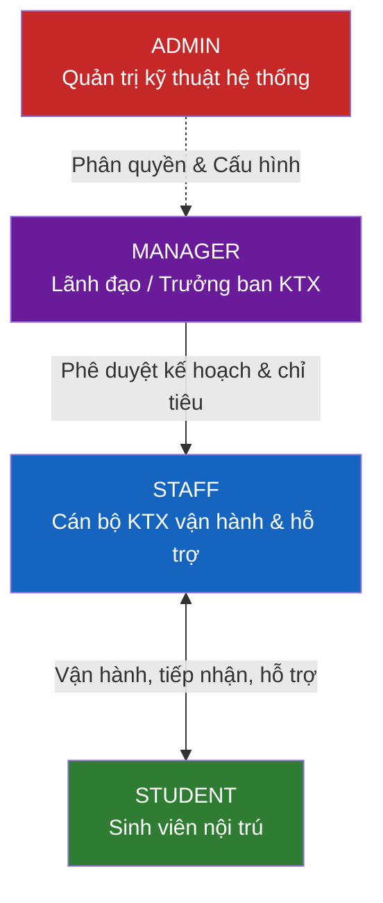

# 07 – PHÂN QUYỀN & BẢO MẬT

**Hệ thống:** DMS-KTX HaUI  
**Phiên bản:** v2.0 (Chuẩn hóa ma trận RBAC 4 vai trò, Bảo mật JWT & Chống IDOR)  
**Ngày cập nhật:** 03/10/2026  

---

## 1. Mô hình phân quyền (RBAC)

Hệ thống áp dụng mô hình **Kiểm soát truy cập dựa trên vai trò (Role-Based Access Control - RBAC)** với **4 vai trò nghiệp vụ cố định**:



| Vai trò | Tên vai trò | Trách nhiệm & Quyền hạn cốt lõi | Phạm vi dữ liệu |
| :--- | :--- | :--- | :--- |
| `admin` | **System Administrator** | Quản trị kỹ thuật toàn hệ thống: quản lý tài khoản, phân quyền, cấu hình hệ thống, sao lưu CSDL, giám sát bảo mật | Toàn bộ hệ thống |
| `manager` | **Trưởng Ban QLKTX** | Lãnh đạo phê duyệt: mở đợt tiếp nhận, duyệt danh sách trúng tuyển, duyệt chuyển phòng, duyệt thanh lý/hoàn cọc, xem báo cáo doanh thu tài chính | Toàn bộ dữ liệu nghiệp vụ |
| `staff` | **Cán bộ KTX vận hành** | Vận hành hằng ngày: kiểm tra hồ sơ, quét mã QR Check-in bàn giao giường, chốt chỉ số điện nước theo lô, lập hóa đơn, điều phối bảo trì sự cố, lập biên bản vi phạm, trực chat hỗ trợ | Dữ liệu nghiệp vụ được phân công |
| `student` | **Sinh viên HaUI** | Người thụ hưởng dịch vụ: xem thông tin phòng ở, thanh toán VietQR tiền phòng/điện nước, nhận phòng bằng mã QR, gửi báo hỏng thiết bị, gửi đơn xin chuyển/trả phòng, nhắn tin trực tuyến với cán bộ | **Chỉ dữ liệu của chính mình** |

> ⚠️ **Lưu ý đặc biệt:** Vai trò `student` thuộc một nhánh quyền hoàn toàn độc lập. Sinh viên **tuyệt đối không** được đọc dữ liệu của sinh viên khác hoặc xem các báo cáo tổng quan của KTX (áp dụng nguyên tắc Least Privilege).

---

## 2. Ma trận phân quyền chi tiết (RBAC Matrix)

**Ký hiệu quy ước:**
- ✅ **Toàn quyền:** Được phép Xem, Thêm, Sửa, Duyệt, Xóa/Hủy theo thẩm quyền
- 👁 **Chỉ đọc:** Được xem dữ liệu hoặc xem danh sách
- 🔒 **Sở hữu riêng:** Chỉ được thao tác hoặc xem dữ liệu gắn với ID của chính mình (`req.user.studentId`)
- ❌ **Cấm tuyệt đối:** Không có quyền truy cập (hệ thống chặn ở tầng Router bằng HTTP 403 Forbidden)

### 2.1. Quản trị hệ thống & Cấu hình cơ sở

| Chức năng chi tiết | admin | manager | staff | student |
| :--- | :---: | :---: | :---: | :---: |
| Quản lý tài khoản người dùng (`User`) | ✅ | 👁 | ❌ | ❌ |
| Phân quyền & Khóa/Mở khóa tài khoản | ✅ | ❌ | ❌ | ❌ |
| Đặt lại mật khẩu cho cán bộ | ✅ | ❌ | ❌ | ❌ |
| Đặt lại mật khẩu cho sinh viên | ✅ | ✅ | ✅ | ❌ |
| Cấu hình Cơ sở (Campuses), Tòa nhà (Buildings) | ✅ | 👁 | 👁 | 👁 *(công khai)* |
| Cấu hình Phòng (Rooms), Giường (Beds) | ✅ | 👁 | 👁 | 👁 *(công khai)* |
| Đổi trạng thái bảo trì phòng/giường | ✅ | ✅ | ✅ | ❌ |
| Cấu hình năm học, bảng giá & tham số hệ thống | ✅ | 👁 | ❌ | ❌ |

### 2.2. Đợt mở KTX, Nộp đơn & Xét duyệt trúng tuyển

| Chức năng chi tiết | admin | manager | staff | student |
| :--- | :---: | :---: | :---: | :---: |
| Tạo / Cập nhật đợt nộp đơn (`ApplicationPeriod`) | ✅ | ✅ | 👁 | 👁 |
| Nộp đơn đăng ký KTX công khai (không cần login) | — | — | — | ✅ *(Công khai)* |
| Tra cứu kết quả nộp đơn công khai | — | — | — | ✅ *(Công khai)* |
| Xem danh sách đơn đăng ký KTX | ✅ | ✅ | ✅ | ❌ |
| Thẩm tra hồ sơ minh chứng ưu tiên / thể chất | ✅ | ✅ | ✅ | ❌ |
| Phê duyệt trúng tuyển & Tự động gán giường | ✅ | ✅ | ❌ | ❌ |
| Kích hoạt tự động sinh tài khoản & gửi Email | ✅ | ✅ | ❌ | ❌ |

### 2.3. Quản lý Sinh viên nội trú & Hợp đồng

| Chức năng chi tiết | admin | manager | staff | student |
| :--- | :---: | :---: | :---: | :---: |
| Xem danh sách sinh viên nội trú | ✅ | ✅ | ✅ | ❌ |
| Xem chi tiết hồ sơ cá nhân sinh viên | ✅ | ✅ | ✅ | 🔒 |
| Xem danh sách bạn cùng phòng | ✅ | ✅ | ✅ | 🔒 *(chỉ xem họ tên + MSSV)* |
| Tạo hợp đồng lưu trú | ✅ | ✅ | ✅ | ❌ |
| Quét mã QR Check-in bàn giao giường nhận phòng | ✅ | ❌ | ✅ | ❌ |
| Hiển thị mã QR Check-in của cá nhân | ❌ | ❌ | ❌ | 🔒 |
| Chấm dứt hợp đồng trước hạn | ✅ | ✅ | ❌ | ❌ |

### 2.4. Điện nước, Tài chính & Thanh toán

| Chức năng chi tiết | admin | manager | staff | student |
| :--- | :---: | :---: | :---: | :---: |
| Nhập chỉ số điện nước theo lô (Tòa / Tầng) | ✅ | 👁 | ✅ | ❌ |
| Sinh hóa đơn tiền phòng / hóa đơn điện nước | ✅ | ✅ | ✅ | ❌ |
| Xem danh sách toàn bộ hóa đơn | ✅ | ✅ | ✅ | 🔒 |
| Tạo mã VietQR động thanh toán hóa đơn | ❌ | ❌ | ❌ | 🔒 |
| Ghi nhận thanh toán thủ công (tiền mặt) | ✅ | ✅ | ✅ | ❌ |
| Xử lý Webhook thanh toán tự động (IPN) | ✅ *(Hệ thống)* | — | — | — |
| Hủy hóa đơn sai lệch | ✅ | ✅ | ❌ | ❌ |

### 2.5. Nghiệp vụ phát sinh (Chuyển phòng, Báo hỏng, Kỷ luật)

| Chức năng chi tiết | admin | manager | staff | student |
| :--- | :---: | :---: | :---: | :---: |
| Nộp đơn xin chuyển phòng | ❌ | ❌ | ❌ | 🔒 |
| Phê duyệt đơn xin chuyển phòng | ✅ | ✅ | ❌ | ❌ |
| Gửi phiếu báo hỏng thiết bị (Maintenance Request) | ❌ | ❌ | ❌ | 🔒 |
| Tiếp nhận, điều phối & hoàn thành bảo trì | ✅ | 👁 | ✅ | ❌ |
| Lập biên bản vi phạm nội quy KTX | ✅ | 👁 | ✅ | ❌ |
| Xem danh sách vi phạm nội quy | ✅ | ✅ | ✅ | 🔒 *(của mình)* |
| Nộp đơn xin trả phòng & hoàn cọc | ❌ | ❌ | ❌ | 🔒 |
| Kiểm kê tài sản phòng khi trả | ✅ | ❌ | ✅ | ❌ |
| Phê duyệt quyết toán hoàn tiền cọc | ✅ | ✅ | ❌ | ❌ |

### 2.6. Tương tác KTX 4.0, Chat & Báo cáo

| Chức năng chi tiết | admin | manager | staff | student |
| :--- | :---: | :---: | :---: | :---: |
| Đăng thông báo bảng tin chung KTX | ✅ | ✅ | ✅ | 👁 |
| Nhắn tin trực tuyến thời gian thực (Socket.io) | ✅ | 👁 | ✅ | 🔒 *(Chat với cán bộ)* |
| Nhận chuông thông báo cá nhân | ✅ | ✅ | ✅ | 🔒 |
| Xem Dashboard tổng hợp (tỷ lệ lấp đầy, số liệu) | ✅ | ✅ | ✅ | ❌ |
| Xem biểu đồ doanh thu tài chính & công nợ | ✅ | ✅ | 👁 | ❌ |
| Xuất báo cáo thống kê ra Excel/CSV | ✅ | ✅ | ✅ | ❌ |

---

## 3. Cài đặt kỹ thuật bảo mật & phân quyền

### 3.1. Middleware xác thực và phân quyền (Backend)

```javascript
// core/middlewares/auth.middleware.js
const jwt = require('jsonwebtoken');
const User = require('../../modules/users/user.model');
const { ApiError } = require('../errors/api.error');

// 1. Xác thực danh tính qua JWT
const authenticate = async (req, res, next) => {
  try {
    const authHeader = req.headers.authorization;
    if (!authHeader || !authHeader.startsWith('Bearer ')) {
      throw new ApiError(401, 'UNAUTHORIZED', 'Bạn chưa đăng nhập hoặc thiếu Bearer Token');
    }

    const token = authHeader.split(' ')[1];
    let decoded;
    try {
      decoded = jwt.verify(token, process.env.JWT_SECRET);
    } catch (err) {
      if (err.name === 'TokenExpiredError') {
        throw new ApiError(401, 'TOKEN_EXPIRED', 'Phiên đăng nhập đã hết hạn, vui lòng đăng nhập lại');
      }
      throw new ApiError(401, 'INVALID_TOKEN', 'Mã xác thực không hợp lệ');
    }

    // Kiểm tra tài khoản trong DB để tránh trường hợp token còn hạn nhưng user đã bị khóa
    const user = await User.findById(decoded.userId).select('+mustChangePassword');
    if (!user || !user.isActive) {
      throw new ApiError(401, 'ACCOUNT_INACTIVE', 'Tài khoản không tồn tại hoặc đã bị khóa');
    }

    // Gắn thông tin người dùng vào request context
    req.user = {
      userId: user._id.toString(),
      role: user.role,
      studentId: user.studentId ? user.studentId.toString() : null,
      mustChangePassword: user.mustChangePassword
    };

    next();
  } catch (error) {
    next(error);
  }
};

// 2. Kiểm tra vai trò RBAC
const authorize = (...allowedRoles) => {
  return (req, res, next) => {
    if (!req.user || !allowedRoles.includes(req.user.role)) {
      return next(new ApiError(403, 'FORBIDDEN', 'Bạn không có quyền thực hiện thao tác này'));
    }
    next();
  };
};

// 3. Rào chắn cưỡng bức đổi mật khẩu lần đầu
const requirePasswordChanged = (req, res, next) => {
  if (req.user && req.user.mustChangePassword) {
    return next(new ApiError(403, 'MUST_CHANGE_PASSWORD', 'Vui lòng đổi mật khẩu mới để tiếp tục sử dụng hệ thống'));
  }
  next();
};

module.exports = { authenticate, authorize, requirePasswordChanged };
```

### 3.2. Cơ chế phòng chống lỗ hổng IDOR (Insecure Direct Object Reference)

Lỗ hổng IDOR xảy ra khi sinh viên thay đổi ID trên URL (ví dụ: `GET /portal/my-invoices/60d...`) để xem hoặc thao tác trên dữ liệu của người khác.

**Quy tắc phòng thủ 2 lớp bắt buộc:**
1. **Lớp 1 - API dạng danh sách:** Tuyệt đối không nhận `studentId` từ query string hay request body từ phía client. Luôn trích xuất `req.user.studentId` trực tiếp từ JWT Token đã được xác thực an toàn.
   ```javascript
   // ĐÚNG:
   const invoices = await invoiceService.findByStudent(req.user.studentId);
   ```
2. **Lớp 2 - API chi tiết theo ID:** Khi truy vấn một tài nguyên cụ thể (hóa đơn, hợp đồng, đơn từ), dịch vụ backend bắt buộc phải kiểm tra quyền sở hữu trước khi trả dữ liệu:
   ```javascript
   const invoice = await Invoice.findById(req.params.id);
   if (!invoice) throw new ApiError(404, 'NOT_FOUND', 'Không tìm thấy hóa đơn');
   
   // Bảo vệ IDOR
   if (req.user.role === 'student' && invoice.studentId.toString() !== req.user.studentId) {
     throw new ApiError(403, 'FORBIDDEN_RESOURCE', 'Bạn không có quyền truy cập hóa đơn này');
   }
   ```

---

## 4. Các giải pháp an toàn thông tin bắt buộc

1. **Băm mật khẩu (Password Hashing):** Sử dụng `bcrypt` với `saltRounds = 10`. Mật khẩu dạng rõ tuyệt đối không bao giờ được ghi vào CSDL hoặc in ra file log. Trường `passwordHash` trong Mongoose model luôn có cấu hình `select: false`.
2. **Bảo mật thanh toán & Idempotency:**
   - Mã VietQR được ký dữ liệu chuẩn hóa;
   - Webhook tiếp nhận thanh toán bắt buộc kiểm tra trạng thái giao dịch ngân hàng theo nguyên lý Idempotent: nếu giao dịch đã hoàn tất, không cập nhật hóa đơn lần thứ hai;
   - Secret key của cổng VNPay được lưu an toàn trong biến môi trường `.env`.
3. **Chống tấn công Brute-Force & DoS:**
   - Giới hạn tần suất (Rate Limiting) trên các endpoint nhạy cảm: `POST /api/auth/login` tối đa 5 lần sai trong 15 phút; `POST /api/portal/apply-public` tối đa 10 đơn/phút từ 1 IP;
   - Sử dụng thư viện `helmet` thiết lập các HTTP headers bảo mật (CSP, X-Content-Type-Options, HSTS).

---

## 5. Lịch sử phiên bản tài liệu

| Phiên bản | Ngày | Người thực hiện | Nội dung thay đổi |
|-----------|------|------------------|-------------------|
| v1.0 | 11/09/2026 | Nhóm phát triển | Bản khởi tạo đầu tiên (mô hình 4 vai trò có `viewer`) |
| **v2.0** | **03/10/2026** | **Lead Kỹ thuật & BA** | **Cập nhật toàn diện ma trận RBAC theo 4 vai trò chuẩn:** `admin`, `manager`, `staff`, `student` (loại bỏ `viewer`). Bổ sung phân quyền cho 10 phân hệ nghiệp vụ hoàn chỉnh (Nộp đơn công khai, Quét mã QR Check-in, Báo hỏng thiết bị, Kỷ luật vi phạm, Chat trực tuyến Socket.io, Bảng tin KTX, VietQR). Chuẩn hóa cơ chế cưỡng bức đổi mật khẩu và rào chắn chống IDOR. |
