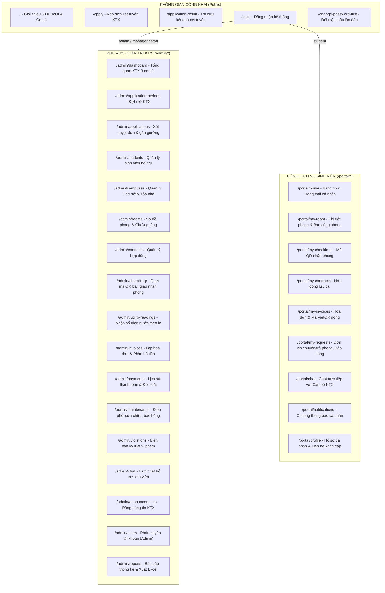

# 08 – THIẾT KẾ GIAO DIỆN (UI/UX)

**Hệ thống:** DMS-KTX HaUI (Quản lý Ký túc xá Trường Đại học Công nghiệp Hà Nội)  
**Phiên bản:** v2.0 (Chuẩn hóa Sitemap & Danh mục màn hình KTX 4.0)  
**Ngày cập nhật:** 03/10/2026  
**Đối tượng:** Nhóm Frontend & Hội đồng đánh giá đồ án  

---

## 1. Nguyên tắc thiết kế giao diện

| # | Nguyên tắc cốt lõi | Chi tiết áp dụng thực tế trong hệ thống |
|---|---|---|
| **1** | **Chuyên biệt hóa theo vai trò** | Tách bạch rõ ràng 2 không gian trải nghiệm: Cổng Quản trị (`/admin/*`) tập trung mật độ thông tin cao cho cán bộ; Cổng Sinh viên (`/portal/*`) thoáng đãng, tối ưu hóa giao diện di động (Mobile-First). |
| **2** | **Tối ưu hóa thao tác vận hành (≤ 3 clicks)** | Các thao tác thường nhật như: Duyệt đơn trúng tuyển, Quét mã QR nhận phòng, Nhập chỉ số điện nước theo lô, Ghi nhận thanh toán đều có thể truy cập và hoàn tất trong tối đa 3 cú nhấp chuột từ Dashboard. |
| **3** | **Trực quan hóa trạng thái tức thời** | Trạng thái giường (`available`, `occupied`, `maintenance`), trạng thái hóa đơn (`unpaid`, `paid`, `overdue`), hợp đồng (`active`, `expired`) được mã hóa bằng thẻ màu (Tag) đồng nhất toàn hệ thống. |
| **4** | **Phòng ngừa thao tác sai lầm (Safe UX)** | Các thao tác nhạy cảm (chấm dứt hợp đồng trước hạn, hủy hóa đơn, khóa tài khoản, lập biên bản kỷ luật) bắt buộc có hộp thoại Modal xác nhận ghi rõ lý do và cảnh báo hệ quả pháp lý. |
| **5** | **Khả năng tiếp cận & Nhân văn (Accessibility)** | Cảnh báo trực quan bằng biểu tượng đặc biệt (Badge y tế) đối với các sinh viên có vấn đề thể chất/sức khỏe (`hasHealthCondition: true`), gợi ý tự động gán giường tầng dưới (`lower bed`). |

---

## 2. Sơ đồ điều hướng hệ thống (Sitemap)

---

## 3. Danh mục màn hình hoàn chỉnh (Screens List)

### 3.1. Nhóm Công khai & Xác thực (Public & Auth)

| Mã màn hình | Tên màn hình | Đường dẫn URL | Vai trò truy cập | Chức năng chính |
| :--- | :--- | :--- | :--- | :--- |
| **SCR-01** | Trang giới thiệu KTX HaUI | `/` | Công khai | Giới thiệu 3 cơ sở (CS1, CS2, CS3), biểu phí, hình ảnh phòng mẫu, nội quy KTX |
| **SCR-02** | Nộp đơn xét tuyển KTX | `/apply` | Công khai | Điền thông tin nộp đơn theo đợt bằng MSSV, chọn nguyện vọng loại phòng, đính kèm minh chứng ưu tiên / sức khỏe |
| **SCR-03** | Tra cứu kết quả xét tuyển | `/application-result` | Công khai | Tra cứu trạng thái đơn nộp bằng MSSV + Số CCCD |
| **SCR-04** | Đăng nhập hệ thống | `/login` | Công khai | Đăng nhập bằng MSSV (sinh viên) hoặc Username/Email (cán bộ) + Mật khẩu |
| **SCR-05** | Đổi mật khẩu bắt buộc lần đầu | `/change-password-first`| Đăng nhập lần đầu | Cưỡng bức sinh viên đổi mật khẩu mới ngay khi đăng nhập bằng mật khẩu tạm từ Email |

### 3.2. Nhóm Quản trị KTX (Admin / Manager / Staff Portal)

| Mã màn hình | Tên màn hình | Đường dẫn URL | Quyền hạn | Chức năng chính |
| :--- | :--- | :--- | :--- | :--- |
| **SCR-10** | Dashboard KTX 3 cơ sở | `/admin/dashboard` | `admin`, `manager`, `staff` | Thống kê số giường tổng, tỷ lệ lấp đầy, hợp đồng sắp hết hạn, công nợ quá hạn, đơn cần duyệt |
| **SCR-11** | Quản lý đợt mở KTX | `/admin/application-periods` | `admin`, `manager` | Tạo đợt tiếp nhận theo học kỳ, cài đặt thời hạn nộp đơn, chỉ tiêu phòng cho từng cơ sở |
| **SCR-12** | Quản lý & Xét duyệt đơn | `/admin/applications` | `admin`, `manager`, `staff` | Danh sách đơn nộp, xem minh chứng ưu tiên/thể chất, duyệt trúng tuyển, tự động gán giường, gửi Email |
| **SCR-13** | Quản lý sinh viên nội trú | `/admin/students` | `admin`, `manager`, `staff` | Danh sách sinh viên đang ở KTX, tìm kiếm theo MSSV/Phòng/Cơ sở, xem hồ sơ, phụ huynh liên hệ |
| **SCR-14** | Sơ đồ cơ sở & Tòa nhà | `/admin/campuses` | `admin`, `manager`, `staff` | Quản lý 3 cơ sở (CS1, CS2, CS3), tòa nhà, phân loại giới tính (`male`, `female`, `mixed`) |
| **SCR-15** | Sơ đồ phòng & Giường tầng | `/admin/rooms` | `admin`, `manager`, `staff` | Ma trận phòng theo tầng, hiển thị trực quan giường tầng trên/dưới, trạng thái bảo trì |
| **SCR-16** | Quản lý hợp đồng lưu trú | `/admin/contracts` | `admin`, `manager`, `staff` | Danh sách hợp đồng, thời hạn hợp đồng (8.5T hoặc 10-12T), in hợp đồng điện tử, gia hạn |
| **SCR-17** | Quét mã QR Check-in nhận phòng | `/admin/checkin-qr` | `admin`, `staff` | Sử dụng webcam/camera điện thoại quét mã QR của sinh viên, kiểm tra đối chiếu và bàn giao giường |
| **SCR-18** | Nhập số điện nước theo lô | `/admin/utility-readings` | `admin`, `staff` | Bảng nhập nhanh chỉ số điện nước theo Tòa/Tầng dạng lưới (Grid), tự động cảnh báo số âm hoặc đột biến |
| **SCR-19** | Quản lý Hóa đơn & Phân bổ | `/admin/invoices` | `admin`, `manager`, `staff` | Danh sách hóa đơn tiền phòng/điện nước; xem chi tiết công thức chia đều `Math.floor` từng thành viên |
| **SCR-20** | Lịch sử thanh toán & Đối soát | `/admin/payments` | `admin`, `manager`, `staff` | Tra cứu lịch sử thanh toán VietQR / VNPay, gạch nợ thủ công tiền mặt, đối soát giao dịch |
| **SCR-21** | Điều phối bảo trì, báo hỏng | `/admin/maintenance` | `admin`, `staff` | Tiếp nhận phiếu báo hỏng cơ sở vật chất từ sinh viên, phân công thợ sửa chữa, nghiệm thu |
| **SCR-22** | Quản lý kỷ luật & Vi phạm | `/admin/violations` | `admin`, `manager`, `staff` | Lập biên bản vi phạm nội quy KTX (sử dụng thiết bị cấm, về muộn...), trừ điểm rèn luyện |
| **SCR-23** | Kênh trực Chat thời gian thực | `/admin/chat` | `admin`, `staff` | Hộp thư hội thoại trực tuyến (Socket.io) với các phòng và sinh viên cần hỗ trợ khẩn cấp |
| **SCR-24** | Quản lý Bảng tin thông báo | `/admin/announcements` | `admin`, `manager`, `staff` | Đăng tin tức, lịch cắt điện nước, thông báo nộp tiền, nội quy KTX |
| **SCR-25** | Quản lý tài khoản & Phân quyền | `/admin/users` | `admin` | Tạo tài khoản cán bộ, gán vai trò (`admin`, `manager`, `staff`), khóa tài khoản, reset mật khẩu |
| **SCR-26** | Trung tâm báo cáo & Xuất dữ liệu | `/admin/reports` | `admin`, `manager` | Báo cáo doanh thu tiền phòng, điện nước theo kỳ, danh sách công nợ quá hạn, xuất Excel/CSV |

### 3.3. Nhóm Cổng Dịch vụ Sinh viên (Student Portal)

| Mã màn hình | Tên màn hình | Đường dẫn URL | Chức năng chính |
| :--- | :--- | :--- | :--- |
| **SCR-30** | Trang chủ sinh viên nội trú | `/portal/home` | Bảng tin thông báo chung KTX, trạng thái hợp đồng, nhắc nhở hạn đóng tiền điện nước |
| **SCR-31** | Thông tin phòng ở & Bạn cùng phòng | `/portal/my-room` | Hiển thị Cơ sở, Tòa nhà, Số phòng, Vị trí giường (`lower`/`upper`), danh sách họ tên + MSSV bạn cùng phòng |
| **SCR-32** | Mã QR Check-in nhận phòng cá nhân | `/portal/my-checkin-qr` | Hiển thị mã QR động cá nhân chứa mã hợp đồng và MSSV để cán bộ quét khi làm thủ tục nhận phòng |
| **SCR-33** | Tra cứu hợp đồng lưu trú | `/portal/my-contracts` | Xem chi tiết điều khoản hợp đồng, ngày bắt đầu/kết thúc, số tiền cọc tài sản đã nộp |
| **SCR-34** | Danh sách hóa đơn & Thanh toán VietQR | `/portal/my-invoices` | Xem chi tiết hóa đơn; hiển thị mã VietQR động chứa STK KTX, số tiền và cú pháp chuyển khoản tự động |
| **SCR-35** | Gửi yêu cầu (Chuyển phòng / Trả phòng / Báo hỏng) | `/portal/my-requests` | Biểu mẫu gửi yêu cầu báo hỏng thiết bị phòng, đơn xin chuyển phòng hoặc đơn xin trả phòng hoàn cọc |
| **SCR-36** | Chat trực tiếp với Cán bộ KTX | `/portal/chat` | Giao diện nhắn tin thời gian thực với Ban quản lý KTX giải quyết thắc mắc và sự cố |
| **SCR-37** | Chuông thông báo cá nhân | `/portal/notifications` | Danh sách thông báo đẩy cá nhân (nhắc đóng tiền, thông báo duyệt đơn, lịch sửa chữa) |
| **SCR-38** | Hồ sơ cá nhân & Thông tin liên hệ | `/portal/profile` | Thông tin sinh viên, lớp, khoa viện, số điện thoại, thông tin người liên hệ khẩn cấp (bố/mẹ) |

---

## 4. Hệ thống bảng màu & Trạng thái giao diện (Design System)

Hệ thống sử dụng thư viện **Ant Design 5.x** kết hợp bảng màu nhận diện thương hiệu:

| Phân loại | Tên màu | Mã màu HEX | Ứng dụng thực tế |
| :--- | :--- | :--- | :--- |
| **Primary (Chủ đạo)** | Xanh Công nghiệp HaUI | `#003B73` | Header, Sidebar, nút bấm chính (Primary Button), liên kết |
| **Success (Thành công)** | Xanh lá | `#52C41A` | Tag giường trống (`available`), hóa đơn đã trả (`paid`), hợp đồng hiệu lực (`active`) |
| **Processing (Đang xử lý)** | Xanh dương | `#1890FF` | Giường đã có người ở (`occupied`), giao dịch đang đối soát, đơn đang xử lý |
| **Warning (Cảnh báo)** | Vàng cam | `#FAAD14` | Đơn chờ duyệt (`pending`), hóa đơn chưa thanh toán (`unpaid`), yêu cầu chờ xử lý |
| **Danger / Error (Lỗi)** | Đỏ | `#F5222D` | Hóa đơn quá hạn (`overdue`), hợp đồng bị chấm dứt, biên bản kỷ luật vi phạm |
| **Default / Neutral** | Xám | `#8C8C8C` | Giường bảo trì (`maintenance`), hợp đồng đã hết hạn (`expired`), thông tin cũ |

---

## 5. Lịch sử phiên bản tài liệu

| Phiên bản | Ngày | Người thực hiện | Nội dung thay đổi |
|-----------|------|------------------|-------------------|
| v1.0 | 11/09/2026 | Nhóm phát triển | Danh mục màn hình ban đầu (còn chức năng đăng ký tự do, cửa hàng nhu yếu phẩm) |
| **v2.0** | **03/10/2026** | **Lead Frontend & BA** | **Tái cấu trúc toàn diện theo kiến trúc KTX 4.0 HaUI:** Bổ sung màn hình nộp đơn công khai, tra cứu kết quả, đổi mật khẩu lần đầu, quét QR check-in nhận phòng, nhập điện nước theo lô, trực Chat Socket.io, mã VietQR động; loại bỏ hoàn toàn module nhu yếu phẩm và đăng ký tự do. |
