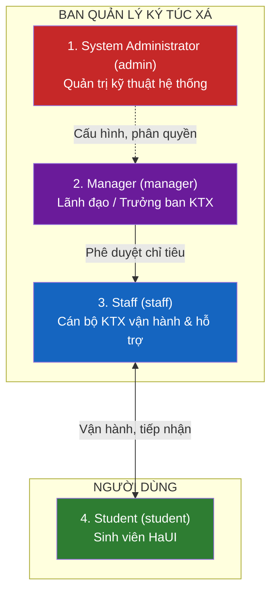

# CHƯƠNG 1. GIỚI THIỆU ĐỀ TÀI

## 1.1. Lý do chọn đề tài

### 1.1.1. Bối cảnh quản lý Ký túc xá tại Trường Đại học Công nghiệp Hà Nội (HaUI)
Trường Đại học Công nghiệp Hà Nội là cơ sở giáo dục đại học công lập đa ngành quy mô lớn với hơn 30.000 sinh viên theo học tại **3 cơ sở đào tạo**:
- **Cơ sở 1 (CS1):** Số 298 đường Cầu Diễn, phường Minh Khai, quận Bắc Từ Liêm, TP. Hà Nội.
- **Cơ sở 2 (CS2):** Phường Tây Tựu, quận Bắc Từ Liêm, TP. Hà Nội.
- **Cơ sở 3 (CS3):** Phường Lê Hồng Phong, TP. Phủ Lý, tỉnh Hà Nam (nơi tập trung 100% tân sinh viên học kỳ giáo dục quốc phòng và thể chất).

Ký túc xá (KTX) HaUI đáp ứng nhu cầu lưu trú cho hàng nghìn sinh viên ngoại tỉnh và lưu học sinh. Công tác vận hành bao gồm tiếp nhận đăng ký, xét duyệt diện ưu tiên, bố trí chỗ ở, thu tiền phòng trọn gói, chốt số điện nước hàng tháng và quản lý kỷ luật, an ninh trật tự.

### 1.1.2. Những khó khăn, bất cập trong quy trình vận hành hiện nay
Qua khảo sát thực tế, quy trình quản lý KTX tại trường vẫn còn tồn tại các điểm nghẽn:
1. **Nghẽn mạng và quá tải đợt cao điểm:** Khi mở cổng đăng ký KTX đầu năm học, hàng nghìn sinh viên truy cập đồng thời trong 15–30 phút đầu gây nghẽn kết nối và sập hệ thống.
2. **Quy trình thủ công và nguy cơ xếp trùng chỗ:** Việc phân chia sinh viên vào các phòng/giường vẫn phụ thuộc vào sổ sách hoặc file Excel rời rạc giữa các cơ sở, tiềm ẩn lỗi tranh chấp chỗ ở.
3. **Thanh toán tiền mặt và đối soát phức tạp:** Sinh viên phải trực tiếp mang tiền mặt xuống văn phòng KTX để đóng tiền phòng và tiền điện nước, gây quá tải cho bộ phận tài vụ và tiềm ẩn rủi ro thất thoát.
4. **Bất cập trong phân bổ thông tin:** Việc thông báo tiền điện nước phòng thường gửi ảnh danh sách lên nhóm chung Zalo khiến sinh viên phải dò tìm thủ công; thiếu kênh tiếp nhận phản ánh sửa chữa sự cố thời gian thực.
5. **Chưa đảm bảo tính nhân văn trong xếp chỗ:** Sinh viên có vấn đề sức khỏe, khuyết tật vận động chưa có cơ chế tự động ưu tiên gán giường tầng dưới và phòng tầng thấp.

### 1.1.3. Tính cấp thiết và giải pháp số hóa KTX 4.0
Nhằm giải quyết triệt để các tồn tại trên, nhóm nghiên cứu đã lựa chọn đề tài: **"Xây dựng hệ thống web quản lý Ký túc xá Trường Đại học Công nghiệp Hà Nội (DMS-KTX HaUI)"**. Hệ thống hướng đến số hóa toàn diện từ khâu nộp đơn trực tuyến, xét duyệt tự động, thanh toán VietQR động, quét mã QR Check-in nhận phòng đến kênh tương tác thời gian thực.

---

## 1.2. Mục tiêu đề tài

### 1.2.1. Mục tiêu tổng quát
Xây dựng một ứng dụng web hoàn chỉnh (Single Page Application trên nền tảng React kết hợp RESTful API Node.js/Express) phục vụ công tác quản lý tập trung 3 cơ sở KTX HaUI, tự động hóa quy trình nghiệp vụ và cung cấp cổng tự phục vụ tiện ích cho sinh viên.

### 1.2.2. Mục tiêu cụ thể (Đo lường bằng chỉ số KPI)

| Mã KPI | Mục tiêu cụ thể | Chỉ số đo lường |
|:---:|---|---|
| **KPI-01** | Số hóa 100% không gian 3 cơ sở | 100% Cơ sở, Tòa nhà, Phòng và Giường được quản lý số; tra cứu phòng trống < 5ms qua Redis Cache |
| **KPI-02** | Khả năng chịu tải đợt mở cổng | Chịu tải mượt mà ≥ 1.000 req/s thông qua hàng đợi Redis BullMQ không nghẽn CSDL |
| **KPI-03** | Triệt tiêu lỗi trùng giường | 0% trường hợp xếp trùng giường nhờ cơ chế cập nhật có điều kiện nguyên tử trên MongoDB |
| **KPI-04** | Tự động hóa cấp tài khoản | 100% sinh viên trúng tuyển nhận được Email tự động chứa MSSV và mật khẩu tạm thời |
| **KPI-05** | Tối ưu hóa tính nhân văn | 100% sinh viên có chỉ định thể chất được hệ thống khóa gán giường tầng dưới (`lower bed`) |
| **KPI-06** | Tự động hóa gạch nợ VietQR | Thanh toán tiền phòng/điện nước qua mã VietQR động, gạch nợ tức thời qua Webhook |
| **KPI-07** | Nhận phòng bằng mã QR | Rút ngắn thời gian bàn giao phòng xuống < 30 giây bằng thao tác quét mã QR cá nhân |

---

## 1.3. Phạm vi đề tài

### 1.3.1. Phạm vi nghiệp vụ triển khai (In-scope)
Hệ thống bao gồm **10 phân hệ nghiệp vụ** được áp dụng cho 3 cơ sở đào tạo của HaUI:
1. **Quản lý cơ cấu không gian 4 cấp:** Quản lý Cơ sở (CS1, CS2, CS3) → Tòa nhà (tòa nam, tòa nữ, hoặc tòa phân tầng riêng biệt) → Phòng (phân định giới tính nam/nữ, loại 4/6/8 giường, trang bị điều hòa/quạt) → Giường tầng (`lower`/`upper`).
2. **Đợt mở KTX & Cổng nộp đơn công khai:** Sinh viên nộp đơn online bằng MSSV theo đợt tuyển sinh.
3. **Xét duyệt & Tự động cấp tài khoản:** Hội đồng duyệt đơn, tự động xếp giường và gửi Email thông báo trúng tuyển.
4. **Hợp đồng lưu trú & Check-in QR:** Quản lý vòng đời hợp đồng, bàn giao nhận phòng qua quét mã QR.
5. **Quản lý sinh viên nội trú:** Quản lý hồ sơ nhân thân, liên hệ khẩn cấp, bạn cùng phòng.
6. **Điện nước & Tài chính:** Nhập chỉ số theo lô (hoặc file Excel), chia đều tiền phòng `Math.floor` dồn dư cho MSSV nhỏ nhất.
7. **Thanh toán VietQR động & Cổng thanh toán:** Tạo mã VietQR chứa chính xác số tiền và cú pháp hóa đơn, hỗ trợ VNPay Sandbox.
8. **Nghiệp vụ phát sinh:** Tiếp nhận đơn xin chuyển phòng, phiếu báo hỏng thiết bị, lập biên bản vi phạm nội quy.
9. **Tương tác KTX 4.0:** Kênh chat Socket.io giữa sinh viên và cán bộ trực KTX, chuông thông báo cá nhân, bảng tin KTX.
10. **Báo cáo thống kê & Dashboard:** Biểu đồ tỷ lệ lấp đầy, doanh thu tài chính, danh sách nợ quá hạn.

### 1.3.2. Giới hạn ngoài phạm vi (Out-of-scope)
- Không triển khai mô hình Multi-tenant đa trường (hệ thống phục vụ chuyên biệt nội bộ HaUI).
- Không xây dựng module bán hàng nhu yếu phẩm/thương mại điện tử.
- Không tích hợp thiết bị phần cứng kiểm soát cổng từ vân tay/thẻ RFID (được đề xuất ở hướng phát triển mở rộng).

---

## 1.4. Đối tượng sử dụng (4 Tác nhân hệ thống)

1. **System Administrator (`admin`):** Quản trị tài khoản, phân quyền, cấu hình hệ thống và giám sát bảo mật.
2. **Manager (`manager` - Trưởng ban KTX):** Mở đợt tiếp nhận, duyệt trúng tuyển, duyệt chuyển phòng, duyệt quyết toán hoàn cọc, xem báo cáo doanh thu tài chính.
3. **Staff (`staff` - Cán bộ KTX vận hành):** Tiếp nhận hồ sơ, quét mã QR Check-in bàn giao giường, nhập chỉ số điện nước, điều phối sửa chữa sự cố, lập biên bản vi phạm, trực chat hỗ trợ.
4. **Student (`student` - Sinh viên):** Nộp đơn công khai, đổi mật khẩu lần đầu, quét QR nhận phòng, thanh toán VietQR, báo hỏng thiết bị, nộp đơn chuyển/trả phòng, chat trực tiếp với cán bộ KTX.

---

## 1.5. Công nghệ dự kiến

| Thành phần | Công nghệ lựa chọn | Lý do và vai trò kỹ thuật |
|---|---|---|
| **Frontend** | React 18 + Vite, Ant Design | Xây dựng giao diện SPA tốc độ cao, hỗ trợ bảng dữ liệu lớn, tối ưu hóa giao diện di động cho sinh viên |
| **Backend** | Node.js + Express.js | Kiến trúc Modular Monolith linh hoạt, xử lý I/O bất đồng bộ hiệu quả cao |
| **Cơ sở dữ liệu** | MongoDB + Mongoose ODM | Lưu trữ tài liệu dạng Document linh hoạt, hỗ trợ cập nhật nguyên tử `findOneAndUpdate` chống trùng giường |
| **Bộ nhớ đệm & Queue**| Redis In-Memory + BullMQ | Dàn phẳng đỉnh tải nộp đơn đợt cao điểm; Caching danh sách phòng trống giảm 95% tải database |
| **Giao tiếp thời gian thực**| Socket.io Engine | Đẩy thông báo chuông cá nhân và phục vụ kênh chat trực tuyến giữa sinh viên và cán bộ trực KTX |
| **Dịch vụ thanh toán & Email**| VietQR (NAPAS 247), Nodemailer | Tự động sinh mã QR ngân hàng thanh toán chuẩn hóa; tự động hóa gửi email trúng tuyển kèm mật khẩu tạm |
